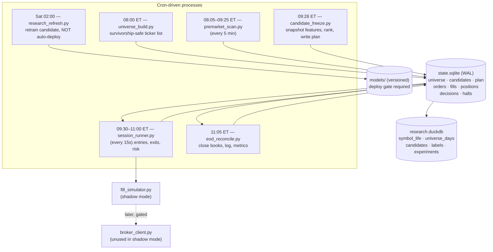

# Intraday Shadow-Mode Trading System
## Design & Feasibility Document — v2.1

**Revision date:** 2026-09-15
**Supersedes:** "CopyCat AI" v1 (copy-trading / multi-day swing / insider-disclosure signals). That design is dead. The signal sources were multi-day and the sequencing deferred edge validation to week 6.

**v2.1 changes:**
1. **The data stack is now entirely free.** Polygon Stocks Starter ($29/mo) is removed. Alpaca's free tier (IEX-sourced) is the single source for both research and live. §3.1 records what this simplifies (the IEX divergence problem disappears) and what it costs (shorter history, harder survivorship).
2. **§7 is rewritten** around a **Signal Validation Study**: a pre-registered statistical test of whether the stock-picking method has predictive power at all, runnable before a line of execution code exists, producing one number and one pre-committed decision. That study is now the gate on everything past week 3.

**What this is:** A solo developer, one laptop, building an intraday US-equities trading system that runs in **shadow mode** — paper trading against live market data, no real capital — until it demonstrates edge over months of forward data.

**Operating envelope:**

| Parameter | Value |
|---|---|
| Mode | Shadow / paper only. No broker write credentials exist on the machine. |
| Holding period | Minutes to hours. Intraday only. |
| Session | Pre-market scan 08:00–09:25 ET → trade 09:30–10:55 ET → **flat by 11:00 ET**, hard. |
| Nominal capital | $1,000 (simulated) |
| Position size | $200–500, **one position at a time** |
| Risk per trade | $15–30 (1.5–3% of nominal) |
| Account type | Cash account (margin minimum is $2,000). T+1 settlement is a modeled constraint. |
| Broker (eventual) | Robinhood. Zero commission. Dominant cost is spread + slippage, not fees. |
| Universe | All tradeable US equities, filtered (§3.2) |
| **Data stack** | **All-free. Alpaca free tier (IEX) for research *and* live. No paid feed at any point in this plan.** |

---

## 1. Feasibility Assessment

**Verdict: the software is very buildable. The edge is the open question, and the base rate is against you.**

Separate three claims that get conflated:

1. *Can a solo dev build a reliable intraday scanner, simulator, and risk engine on a laptop?* Yes. This is ordinary systems work. 8–12 weeks.
2. *Can that system find a statistically real intraday edge?* Unknown, and this is the entire project. Most of this document exists to make you find out in week 3 instead of week 20.
3. *Would that edge produce meaningful money on $1,000?* No. See §1.3.

### 1.1 The base rate

The published research on retail day trading is consistent and unkind. Large-sample studies of complete brokerage populations (Barber, Lee, Liu, Odean on Taiwan; Chague et al. on Brazil) find that in the long run roughly 1% of day traders are reliably profitable net of costs, and that performance persistence is weak but non-zero — i.e. skill exists and is rare. You should assume you are in the 99% until forward data says otherwise. This is the reason for shadow mode, and the reason §9 exists.

This does **not** mean stop. It means the deliverable of this project is a *measurement* — a defensible answer to "does my strategy have positive expectancy net of realistic friction?" — and the honest prior on that answer is "no." Build the measurement apparatus well enough that you'll believe the answer either way.

### 1.2 What the constraints actually buy you

- **Shadow mode removes the failure mode that kills most projects**: losing real money during the period when your fill model is wrong and your bug count is highest. It also means you need **zero trading credentials**, which eliminates an entire security surface (§10).
- **Intraday holding removes overnight gap risk.** For a $500 position with a $25 stop, a single -20% overnight gap is -$100: four trades of risk budget gone while you sleep. Flat-by-11:00 makes this structurally impossible.
- **Intraday also removes your data advantage.** The insider/congressional disclosure angle from v1 was the one signal class with a *complete population* — every Form 4 filer, every PTR — which is the only structural defense against survivorship bias. Intraday signals do not have that property. You are now competing against people who see the same gap list you do, faster. Your edge cannot be "I found the gapper." It must be in selection and in risk discipline.

### 1.3 The dollar arithmetic, stated plainly

Take a favorable-but-not-absurd outcome: 0.15R expectancy per trade, $22 average risk, 1.5 trades/day (T+1 settlement caps you; see §6.4), 250 trading days.

```
0.15 × $22 × 1.5 × 250 ≈ $1,240/year on $1,000 nominal
```

That looks like a 124% return. In dollars it is **$4.95/day**. Now consider what infrastructure would cost:

| Item | Paid stack (rejected) | **All-free stack (chosen)** |
|---|---|---|
| Real-time consolidated market data (Polygon Developer tier or equivalent) | $950/yr | $0 — Alpaca free tier, IEX only |
| Historical minute bars (Polygon Stocks Starter, $29/mo) | $348/yr | $0 — Alpaca free tier historical |
| Halts, news, corporate actions | $0 | $0 |
| VPS ($5/mo) | $60/yr | $60/yr |
| **Total** | **~$1,358/yr** | **~$60/yr** |

At $1,000 of capital, the paid column consumes **more than 100% of a favorable-case year's profit** before a single trade goes wrong. The $29/mo historical tier alone is $348 — 28% of the good-case outcome — bought to improve a measurement whose honest prior says the answer is "no edge." That is not a defensible purchase at this account size. Conclusions that follow directly:

- **Run the entire project on free data.** Not "free during shadow mode" — free, full stop, until a strategy has cleared the §7.14 gate *and* the §8.1 shadow gates and you are about to fund. The first dollar of data spend is authorized by a passing result, not by a hope of one.
- **Treat this as R&D, not income.** The asset you're building is a validated strategy and the harness that validated it. If it works, capital scales; if it doesn't, you've spent $60 and learned something true.
- Reject any design decision justified by "it'll make a bit more money." At this size, nothing does.
- **Accept that free data makes the measurement weaker, and design the measurement around that** rather than pretending otherwise. §3.1 lists exactly what is lost; §7 is built to survive it.

### 1.4 What is not realistic

- Competing on latency. Your laptop, over consumer internet, through a retail broker, is 3–5 orders of magnitude behind anyone doing this professionally. Never design a strategy whose edge decays in under ~60 seconds.
- Deep learning. You will have a few hundred to a few thousand labeled trades. See §5.1.
- Beating the opening auction. 09:30:00–09:30:30 is the single most adversarial half-minute of the day for a retail order. Design entries that tolerate starting at 09:32 or later.
- Trusting a backtest. See §7.

---

## 2. Architecture

The v1 design (three async pipelines, time-series DB, signal queue) was built for a throughput problem you do not have. You trade at most a few times a day and evaluate a few hundred candidates in a batch. Async buys nothing and costs you debuggability.

**Use separate processes, started by cron, communicating through SQLite tables in WAL mode, with explicit state machines.** Every process is independently runnable from a shell for debugging, and crashes in isolation.



### 2.1 State machine

Every candidate ticker moves through exactly one path. Transitions are rows in `decisions`, never silent.

```
DISCOVERED → FILTERED_OUT(reason)
DISCOVERED → QUALIFIED → RANKED → REJECTED(reason)
                              → PLANNED → ENTRY_PENDING → ENTRY_FILLED
                                                       → ENTRY_EXPIRED
ENTRY_FILLED → EXIT_STOP | EXIT_TARGET | EXIT_TIME | EXIT_RISK_HALT
```

Rules:
- `session_runner.py` is the **only** writer to `orders`, `fills`, `positions`.
- No in-memory state survives a process exit. On start, every process reconstructs from SQLite. If you can't `kill -9` any process at any moment and restart cleanly, it's wrong.
- One schema migration file per change, applied at startup, version recorded in a `schema_version` table.

### 2.2 The shared-code-path rule

**Backtest, shadow mode, and (eventually) live must call the same feature and signal code.** The single most common way retail systems fail is a feature computed one way in the notebook and another way in the runner. Enforce it structurally:

```
strategy/
  features.py      # pure functions: (bars_df, asof_ts) -> feature dict
  signals.py       # pure: (feature dict) -> Signal | None
  sizing.py        # pure: (Signal, account_state) -> order intent
  barriers.py      # pure: entry -> (stop, target, time_limit)
```

Nothing in `strategy/` may do I/O, read the clock, or know whether it's in a backtest. Everything above it (loaders, runner, simulator) does. Write one test that runs a fixed day's bars through the backtester and through the runner-in-replay-mode and asserts identical signals.

**Note on sequencing:** the §7 Part I validation study runs *before* `strategy/` exists, in a separate `research/` tree with its own throwaway signal functions. That is deliberate — see §7.1. When a family passes, its frozen definition is *ported* into `signals.py` and a test asserts the ported version reproduces the study's signal set bit-for-bit on a sample of days.

---

## 3. Data Sources & Universe

### 3.1 Market data — all free

You need three things: **historical intraday bars** (research/validation), **live pre-market and intraday quotes** (shadow mode), and **corporate action / delisting history** (survivorship).

| Need | Source | Cost | Honest caveats |
|---|---|---|---|
| Live quotes + bars, shadow phase | **Alpaca** (free tier) | $0 | Real-time data is **IEX only** (~2% of consolidated volume, and that share drifts). Volume and VWAP are systematically understated. Mitigations in §7.3. |
| Historical minute bars | **Alpaca historical** (free tier) | $0 | IEX-sourced, same distortions, and **shorter history than a paid tier**. Depth is account-dependent — measure it on day 2 and record it (§7.12); do not assume it from documentation. |
| Paper-trading validation | **Alpaca paper API** | $0 | A free second opinion against your own `fill_simulator.py`. Where the two disagree on a fill, investigate; don't average them. |
| Halts / LULD | **Nasdaq Trader halt feed** (free, delayed) | $0 | Essential — see §6.5. Delayed, so it is a *research and reconciliation* source, not a real-time veto; the real-time veto is the spread and the LULD state from the quote. |
| News catalysts | **Finnhub free** and/or **Alpaca news** (free) | $0 | Timestamp fidelity is the whole ballgame; see §3.4. Free tiers have rate limits and thinner small-cap coverage — treat missing news as "unknown," never as "no catalyst." |
| Corporate actions / delistings | **Alpaca assets (incl. inactive)** + **SEC EDGAR** + archived **Nasdaq symbol directory** | $0 | The survivorship workaround. This is the weakest link in the free stack and §7.2 exists entirely to make it defensible. |
| Consolidated real-time (SIP) — Polygon Developer / Databento | *Not part of this stack* | $79–99+/mo | Out of scope. Revisit only after §7.14 passes **and** §8.1 passes and you are funding. Buying it earlier is buying a better measurement of a thing you haven't shown exists. |

#### The IEX divergence problem is gone — a genuine simplification

The v2 design researched on Polygon consolidated data and traded live on Alpaca/IEX. That mismatch was the ugliest thing in the document: "relative volume > 2×" meant one thing in the backtest and a different thing in the runner, and the difference varied by ticker and by day. v2 handled it by paying $29/mo and logging a divergence metric — i.e. by making the distortion visible rather than by removing it.

**With research and live both on Alpaca/IEX, the divergence is identically zero.** No divergence metric, no dual-source loaders, no "which source was this number computed from" column, no class of bug where a strategy is tuned on one signal and run on another. The §2.2 shared-code-path rule now extends all the way down to the data source. Delete that complexity; it was real and it is gone.

**What you are measuring is a distorted world, consistently.** IEX is a real, regulated, continuously-quoted venue, but it sees a small and *non-constant* slice of the tape. Two structural consequences that §7 is built around:

- **IEX share drifts over time and varies by ticker.** An absolute threshold like "relvol > 2.0×" calibrated on one year is a materially different threshold in another year, and a different threshold on a large cap than on a small cap. **Fix: every volume-derived feature enters as a cross-sectional percentile rank within that day's universe, not as an absolute multiple** (§7.3). This is invariant to IEX share drift and should be kept even if consolidated data is ever purchased.
- **Sparse tape ≠ low volume.** A thin name may have *no IEX prints* in a given minute. That produces a missing bar, which naive code reads as zero volume, which is wrong in both directions: it hides activity and it corrupts VWAP. **Fix: an explicit IEX-coverage eligibility gate and an `iex_coverage` feature** (§7.3).

#### What the all-free stack costs you — flag these, don't bury them

**1. Shorter backtest history → fewer regime samples.** This is the serious one. Polygon Starter offered years of minute aggregates; Alpaca's free historical depth is shorter and account-dependent. Direct consequences:

- **Fewer days is less statistical power.** §7.12 makes this arithmetic explicit: at a plausible daily-edge dispersion, detecting a 0.15R effect needs on the order of 70–290 trading days. A short history can put a genuinely real but modest edge permanently out of reach of this test — you would get "not significant," which is not the same as "no edge," and you must not report it as if it were.
- **You may have exactly one volatility regime.** §13.5 already flags this as a top-5 project risk; the free stack makes it worse. If your window contains no high-VIX period and no sustained low-VIX period, you have not learned how the strategy behaves across regimes — you have learned how it behaves in one. **Mandatory: compute the VIX distribution over your actual study window and put it in `docs/data_inventory.md`.** If the window spans fewer than two distinct regimes, that limitation is stated on every result and in the §7.14 verdict, and the shadow phase (§8) — which accumulates forward days at zero marginal cost — becomes the primary source of regime diversity rather than a confirmation step.
- **Fewer rare events.** Halts, LULD trips, and >50% gaps are exactly the tail your §6.5 guards exist for. A short window may contain too few to calibrate against.

**2. Survivorship gets materially harder.** Polygon's `/v3/reference/tickers?date=` was a point-in-time ticker list: one API call, one day's real universe, delisted names included. **There is no free equivalent.** This matters more here than almost anywhere, because the names this design targets — low-float, high-volatility small caps — are precisely the names that delist, and a survivorship-biased backtest of a gap scanner is not slightly optimistic, it is fictional (§13.2).

There is a defensible reconstruction, and it is not hand-waving: §7.2 builds a point-in-time universe from Alpaca's *inactive* asset list, archived Nasdaq symbol directories, and SEC delisting filings, then **measures its residual bias with an attrition audit** and **bounds it with a survivors-only stress test**. Read §7.2 before accepting any result in this document. If the attrition audit fails, the correct action is to stop, not to proceed with a caveat.

**3. Minor but real:** no vendor-maintained split/dividend table, so corporate actions must be derived and spot-checked by hand; thinner free news coverage on small caps; delayed halt data.

### 3.2 Universe filters

Applied by `universe_build.py` at 08:00 using **only prior-close data**, then re-checked at 09:28 with pre-market data:

| Filter | Threshold | Why |
|---|---|---|
| Price | **> $2.00** | Penny floor. Sub-$2 spreads and manipulation risk dominate. |
| Average daily volume (20d) | **> 500,000 shares** | Liquidity for a $200–500 position is trivially satisfied here; the real purpose is excluding names where the quote is a fiction. **On IEX-sourced bars this is IEX volume** — use a consolidated-equivalent estimate or, better, apply the threshold as a cross-sectional percentile (§7.3). |
| ATR(14) / price | **> 2%** | You need range to clear the spread. A 0.8%-ATR stock cannot pay for a 0.3% round-trip friction. Price-based, so IEX-safe. |
| Relative volume (vs 20d same-time-of-day) | **top 20% of the day's universe** | Checked at 09:28 on pre-market volume. Expressed as a **cross-sectional rank**, not an absolute 2.0× multiple, because IEX share drift makes the multiple non-comparable across time (§3.1). |
| IEX coverage | **≥ 70% of prior session's 09:30–10:55 minutes have ≥1 IEX print** | New, forced by the free stack. Below this, every volume feature on the name is noise (§7.3). |
| Security type | Common stock, ADR | Exclude warrants, rights, units, preferreds, and leveraged/inverse ETNs. |
| Exchange | NYSE, Nasdaq, AMEX | No OTC. Non-negotiable. |

**Deliberately *not* filtered: market cap and float.** v1 restricted to S&P 500 large caps, which contradicted its own signal source. That contradiction is resolved by removing the restriction: intraday range lives in small caps and low float. But this is where the edge and the danger are the same place, so replace the ban with named guards (§6.5): no entry within 5 min of a halt resumption, no entry on gaps > 100%, no entry when a same-day offering/dilution headline is present, hard per-name notional cap.

### 3.3 Signal sources (intraday)

Five candidate signal families. Each gets tested independently in §7; you should expect most to fail.

**A. Pre-market gappers**
Gap % = (pre-market last / prior close) − 1, measured at 09:28. Require gap > 4% and pre-market volume above the day's 80th percentile. Sub-threshold gaps have no continuation edge worth trading; unaccompanied gaps (price gap, no volume) mean-revert. The interaction term `gap% × premarket_relvol_rank` matters more than either alone.

**B. Opening range breakout (ORB)**
Define OR as 09:30–09:45. Entry on break of OR high/low with a volume confirmation (breakout-minute volume above the 80th percentile of the ticker's own trailing 15 minutes — a *within-ticker* comparison, which is IEX-safe in a way a cross-ticker volume multiple is not). Stop at the opposite side of the OR or 1× ATR(5min), whichever is tighter. This is the most-published intraday setup in existence — assume it's crowded and demand strong evidence before believing your version works.

**C. VWAP reversion**
Entry when price is > 2 σ from session VWAP with declining volume on the extension, targeting VWAP.

**This is the family most damaged by the all-free stack, and its prior should be lowered accordingly.** VWAP is a volume-weighted price; computed from IEX prints only, it is a ~2% sample of the volume that defines the real VWAP — and it is a *non-random* sample, since IEX's share varies with order type and venue routing. The v2 text said this family "requires consolidated volume to mean anything," and switching to all-IEX does not make that false. What switching *does* fix is the divergence: your research VWAP and your live VWAP are now the same distorted quantity, so a relationship found in research will at least be *present* live. What remains true is that the economic story ("price is far from where the day's volume actually traded, and reverts") is only loosely connected to what you are measuring. Test it, but treat a pass with more suspicion than a pass from A, B, or D, and require the §7.11 negative controls to be spotless before believing it.

Additionally: it needs a regime filter, which is itself a fitted parameter, and it gets destroyed in trend regimes — which, on a short single-regime history (§3.1), you may not have sampled.

**D. Volume-spike continuation**
1-minute volume > 5× the ticker's own trailing 20-min average, with price displacement in the same direction. Within-ticker ratio, so IEX-safe. Fast-decaying: the edge, if any, lives in the following 5–15 minutes. This is the family most likely to be genuinely arbitraged away — and, being within-ticker, it is the family the free stack damages least.

**E. News catalyst**
Headline timestamped in the last 30 minutes, on a ticker already qualified by A–D. Do **not** use news as a primary trigger — timestamp fidelity is too poor (§3.4). Use it as a *filter*: "does this gapper have an identifiable reason?" and as a *veto*: offering, dilution, going-concern, reverse split → no entry, regardless of what the model says.

Note that on free news tiers, small-cap coverage is incomplete. **Absence of a headline means "no headline found," not "no catalyst."** Encode it as a three-valued feature (`has_news ∈ {yes, no, unknown}`) and never let "unknown" silently become "no" — that mislabeling would put real catalyst trades in the no-catalyst bucket and destroy the filter's measured value.

**Explicitly cut from v1** (the review was right):
- Twitter/X monitoring — $200/mo, an unlabeled NLP research problem attached to an unsolvable survivorship problem.
- Copy-trading / signal-vendor feeds — a signal you can buy has no residual edge.
- Insider/congressional disclosures — real but multi-day; wrong horizon for this design.
- Standalone RSI/MACD on daily bars — no evidence of standalone edge, and boosted trees will happily overfit them.

### 3.4 Point-in-time correctness

This killed v1's design silently and it will kill this one too if you're careless. The intraday failure modes are different from the Form 4 ones but just as lethal.

| Trap | What goes wrong | Mitigation |
|---|---|---|
| **Survivorship in the universe** | Scanning today's ticker list over historical data means every delisted, acquired, or bankrupt name is missing — and those are disproportionately the volatile small caps you're targeting. Backtest looks great and is fiction. | **No paid point-in-time ticker API is available in the free stack.** Reconstruct it: §7.2 (Alpaca inactive assets + archived Nasdaq symbol directories + SEC delisting filings → dated symbol-life windows), then *audit* the reconstruction's attrition rate and *bound* the residual with a survivors-only stress test. Never `SELECT DISTINCT ticker FROM bars`. |
| **Split adjustment** | A 1:10 reverse split makes a historical $0.40 stock appear as $4.00 and pass your $2 floor. Forward splits do the reverse. | Store **raw (unadjusted) prices** plus a separate corporate-actions table. Alpaca's bars endpoint exposes an adjustment parameter — fetch **raw** and derive adjustments separately, so the filter sees the price as quoted that day. Compute returns with adjustment. Spot-check by hand; there is no vendor-maintained actions table in this stack. |
| **Scan reconstructibility** | The 09:28 candidate list must be buildable from data that existed at 09:28. Using the day's full volume, or the day's high, to filter candidates is the classic lookahead. | Every feature function takes an explicit `asof_ts` and its loader must refuse to return bars with `ts > asof_ts`. Assert this in code, not in discipline. The §7.11 synthetic-bars control is what catches the violations your assertions miss. |
| **News timestamps** | Vendor `published_at` is often when the vendor ingested it, not when it hit the tape. Off by seconds to minutes, always in the optimistic direction. Free tiers are worse. | Add a fixed **+60s conservatism offset** to every news timestamp in research. If a strategy's edge disappears under that offset, it was reading the future. |
| **News absence** | Free news tiers under-cover small caps. Treating "no headline returned" as "no catalyst" mislabels real catalyst trades into the control bucket. | Three-valued `has_news`. Measure your news source's coverage rate against a hand-checked sample of 50 known-catalyst days before using the feature at all. |
| **Float / shares outstanding** | Vendors serve current float on a historical query. Float changes on offerings — exactly the events you care about. | Either snapshot float daily going forward and only backtest over the snapshotted period, or drop float from the feature set. Do not backtest on current float. |
| **Halt data** | Halted minutes produce no bars; naive code interpolates or skips, making the resumption gap look like a tradeable move. | Join the halt table into bar loading. Mark halted intervals explicitly; strategy code must see a `halted` flag, not a hole. |
| **Missing IEX bars** | A minute with no IEX print is not a minute with no trading. Reading it as zero volume corrupts every volume feature and VWAP. | Distinguish `missing` from `zero` at the loader. Enforce the §3.2 IEX-coverage gate. Carry `iex_coverage` as a feature so you can test whether the edge lives only in well-covered names. |

---

## 4. Broker Integration

### 4.1 Shadow mode needs no broker

In shadow mode, `broker_client.py` is not called. The runner sends order intents to `fill_simulator.py`. **No Robinhood trading credentials should exist on this machine during the shadow phase.** That is a deliberate control, not an oversight (§10).

Alpaca's free **paper-trading API** is available as an independent second opinion on fills. Use it that way — a divergence between your simulator and Alpaca paper is a bug report about one of them, and finding out which is cheap and worth doing.

### 4.2 Do the capability audit in week 1 anyway

The review's core point stands even though shadow mode defers the risk: if the eventual execution path can't support what your strategy needs, you want to know before you spend 20 weeks validating a strategy you can't run. Week 1 is a **read-only documentation spike** — read the official docs, not code against them — answering:

| Question | Why it changes the design |
|---|---|
| Does the agentic/API path permit **unattended** operation, or does each order need human confirmation? | If confirmation is required, this can never be autonomous — it becomes an alerting system and the whole architecture simplifies. Find this out in week 1. |
| Are **stop orders** and **bracket/OCO** supported programmatically? | If protective orders can't rest at the broker, "offline" is not a safe state (§6.6) and you must never leave a position unattended. |
| **Fractional shares with attached stops?** | At $200–500 positions on a $180 stock, share granularity materially distorts sizing. If fractional can't carry a stop, restrict the universe by price so whole-share sizing lands within ±10% of target. |
| Rate limits, session lifetime, re-auth cadence | Determines whether a 15-second polling loop is even legal, and whether an unattended process can survive a session expiry at 10:15 ET. |
| **Cash account behavior on unsettled funds**: does the API surface settled vs. unsettled cash, and does it reject or accept a buy that would create a good-faith violation? | If the API won't tell you, your simulator's settlement ledger (§6.4) is the only source of truth and must be conservative. |
| PDT treatment | Cash accounts are not subject to the $25,000 PDT rule, but **confirm this for the specific account type** rather than assuming. Getting flagged is a 90-day problem. |

Write the answers into `docs/broker_capabilities.md` with a date and a link per answer. Re-verify before funding — these change.

### 4.3 Costs and fills at Robinhood, specifically

Zero commission is not zero cost. What you actually pay:

- **Half the bid-ask spread on entry, half on exit.** On the volatile small caps this universe targets, 0.1–0.5% round trip is typical, and it widens exactly when you want to trade.
- **Slippage on stop exits.** A triggered stop becomes a market order into a move that's already going against you. Budget 0.3–1.0% beyond the stop price on fast names.
- **PFOF routing.** Robinhood routes to wholesalers who pay for the flow. Retail orders often receive *price improvement* versus NBBO on small marketable orders, and the disclosed statistics generally show that. But it is not guaranteed, execution quality varies by wholesaler and by order size, and you cannot direct routing. **Do not model price improvement in your backtest.** Model the full half-spread as a cost and treat any improvement as unmodeled upside. If a strategy needs price improvement to be profitable, it isn't profitable.
- **Regulatory fees.** SEC Section 31 fee and FINRA TAF apply on sells. Pennies at this size, but include them — they're deterministic and there's no reason to omit a known cost.

**Break-even math, worked.** Position $300, stop 5% away → $15 risk, target 2R = $30. All-in friction ~0.75% round trip = $2.25 = 0.15R.

```
Break-even win rate, frictionless, 2:1 R:R:   p·2 − (1−p)·1 = 0        → p = 33.3%
Break-even win rate with 0.15R friction:      p·2 − (1−p)·1 − 0.15 = 0 → p = 38.3%
```

Friction moves your required hit rate by 5 percentage points. That is the entire margin most retail intraday strategies operate on. **Any backtest that does not model spread is not a backtest.** The 0.15R figure is the anchor for the friction haircut in §7.10 and for the decision threshold in §7.14.

---

## 5. Model Design

### 5.1 Start with rules, not ML

You will generate on the order of 1–3 trades per day → **250–750 labeled examples per year**, heavily clustered by day and by market regime (§7.17). This is far too few to fit a model of any complexity, and clustering means your effective sample is smaller than the row count by a large factor.

**Sequence:**

1. **Before anything else: the §7 Part I Signal Validation Study.** Not a model, not a backtest — a statistical test of whether the selection method carries directional information. This is the week 2–3 deliverable and the first kill gate.
2. **Baseline: a hard-coded rule set per signal family (§3.3).** Five parameters maximum per family. If a rules baseline has no edge net of costs, an ML model on the same features has no edge either — it will just find the overfit version.
3. **Only if a baseline clears:** add gradient boosting (**LightGBM** or **XGBoost**, CPU, seconds to train) as a **filter on top of the rules**, not as a replacement. Input: the candidates the rules already accepted. Output: P(trade reaches target before stop). Take the top-k by probability, subject to a minimum threshold. This keeps the model's job small and its failure mode bounded — the worst it can do is decline to trade.
4. **Never:** LSTMs, transformers, anything trained end-to-end on raw price. Not on this sample size.

### 5.2 Labels: triple-barrier

Label every candidate by what execution would actually have done. For each hypothetical entry at time *t*:

| Barrier | Definition |
|---|---|
| Upper (target) | entry + `k_target` × ATR(5min), typically 2R |
| Lower (stop) | entry − 1R, where R is set by `barriers.py` |
| Time | **10:55 ET, hard** — flat-by-11:00 means the time barrier is the session constraint, not a tunable |

Label = which barrier is touched first, evaluated on minute bars with intrabar high/low, applying the **pessimistic intrabar rule**: if a single bar's range touches both barriers, assume the stop hit first. This is not paranoia; it's the only assumption that doesn't systematically inflate results.

This matters because it forces label and execution into agreement. Fitting "will price be higher in 30 minutes" and then executing with a stop produces a model optimized for a game you're not playing.

§7.5 formalizes this as label **L1**, and pairs it with a fixed-horizon label **L2** that is independent of barrier geometry. Read §7.5 for why both are required.

### 5.3 Feature set

Keep it under ~25 features. Every feature must be computable from data available at `asof_ts`.

**Cross-sectional rank rule (all-free stack).** Every volume-derived feature enters as a **percentile rank within that day's eligible universe**, not as an absolute multiple — because IEX's share of consolidated volume drifts over time and varies by ticker (§3.1). Within-*ticker* ratios (this minute's volume vs. this ticker's own trailing 20 minutes) are exempt: they are internally consistent regardless of IEX share, and are preferred where the signal admits them.

**Pre-market / session context:** gap %, pre-market volume (rank), pre-market relative volume (rank), pre-market range as % of ATR, prior-day close-to-close return, ATR(14)/price, 20d ADV (rank), days since last top-decile-relvol day.

**Intraday state:** distance from session VWAP in σ, position within opening range, current 1-min relvol (within-ticker ratio), trailing 5-min volume trend, spread as % of price (**include this — it's a cost predictor and a liquidity signal**), consecutive same-direction minute bars, distance from session high/low, **`iex_coverage`** (fraction of session minutes with ≥1 IEX print).

**Market context:** SPY return since open, SPY 5-min realized vol, VIX level bucket. These stop you from learning "everything works" on a day the whole market rallied. (In §7 the matched-control design handles this structurally; these features remain useful to the model in step 3 above.)

**Catalyst:** `has_news ∈ {yes, no, unknown}`, news age in minutes, catalyst category (earnings / FDA / offering / M&A / none / unknown).

**Do not include:** anything requiring future data, float (§3.4), analyst ratings, daily RSI/MACD.

### 5.4 Retraining

Weekly retrain on Saturday, **producing a candidate, never a deployment.** See the deploy gate in §6.7. The v1 plan's "retrain over the weekend, run the new weights Monday" means a silently degraded model goes live with zero human contact. That's the single highest-leverage bug in the original document.

---

## 6. Risk Management Engine

The risk engine is independent of the model, runs as its own module in `session_runner.py`, and has **veto authority over every order**. It must be fully implemented in shadow mode — validating the risk engine *is* a primary goal of the shadow phase, not a preliminary to it.

### 6.1 Position sizing — risk-based, not notional

v1's "1–2% on a single trade" was ambiguous between position size and capital at risk. Specify it as risk:

```python
risk_dollars = min(RISK_PER_TRADE, remaining_daily_risk_budget)   # $15–30
stop_distance = entry_price - stop_price                          # from barriers.py
shares = floor(risk_dollars / stop_distance)
notional = shares * entry_price

# Hard clamps, applied after:
assert MIN_NOTIONAL <= notional <= MAX_NOTIONAL     # $200 – $500
assert notional <= settled_cash_available           # §6.4
if notional < MIN_NOTIONAL: reject("size_below_floor")
```

The clamp order matters: risk sets the size, notional bounds can only *reject* the trade, never inflate it. If a stock's stop distance is so wide that $15 of risk buys less than $200 of stock, **you don't take that trade** — you don't widen the risk to fit.

### 6.2 Concurrency and concentration

- **One position at a time.** Hard constraint, enforced by a unique partial index on the `positions` table (`WHERE status='OPEN'`), not by application logic.
- No re-entry into the same ticker after a stop-out on the same day. Revenge-trading a name is a documented retail loss pattern, and an automated system will do it faster than you would.
- Maximum 3 entries per day regardless of outcome.

### 6.3 Loss limits — split by cause

v1's "-5% drawdown → liquidate everything" was the right instinct applied wrongly. Separate market moves from system faults:

| Trigger | Action |
|---|---|
| 2 consecutive losing trades | **Halt new entries** for the day. Existing position runs to its barriers. |
| Daily realized loss ≥ $45 (3 × max risk) | **Halt new entries** for the day. |
| Weekly realized loss ≥ $120 | Halt new entries for the week. Manual review required to resume. |
| **Reconciliation mismatch** (§6.6) | **Full flatten + halt.** This is a system fault. |
| Data feed stale > 90 s during a position | **Full flatten + halt.** You are trading blind. |
| Clock ≥ 10:55 ET | **Flatten all** at market. Non-negotiable, no exceptions, no "it's about to come back." |
| Clock ≥ 11:00 ET | Cancel all working orders, assert flat, write EOD row. |

Note the asymmetry: a market move stops you *entering*, a system fault gets you *out*. Liquidating a position because the P&L hit a number is selling at the worst moment for a reason unrelated to that position's thesis.

**On an IEX-only feed, "stale" needs care.** A thin name legitimately produces no IEX prints for 90 seconds. Define staleness against the *feed*, not the *symbol*: the trigger is no message of any kind on the websocket (including heartbeats and other symbols' trades) for 90 s, plus a separate, softer flag for "no print on my open position's symbol for 5 minutes" that widens the effective spread assumption rather than flattening.

### 6.4 T+1 settlement ledger (cash account)

This constraint is easy to forget in a simulator and it changes your realistic trade count. In a cash account, proceeds from a sale settle on **T+1**. You may buy with unsettled proceeds, but selling that new position before the original funds settle is a **good-faith violation**; three GFVs in 12 months triggers a 90-day restriction to settled funds only.

For a day-trading system that always closes same-day, this is binding: **money used for a round trip today is unavailable until tomorrow.**

Implement an explicit ledger:

```sql
CREATE TABLE cash_ledger (
  id INTEGER PRIMARY KEY,
  ts TEXT NOT NULL,
  amount_cents INTEGER NOT NULL,     -- signed
  settles_on TEXT NOT NULL,          -- trade date + 1 business day
  reason TEXT NOT NULL,              -- 'BUY','SELL','FEE','DEPOSIT'
  order_id TEXT
);
-- settled_cash = SUM(amount_cents) WHERE settles_on <= today
```

Rules the risk engine enforces:
- A new entry requires `notional <= settled_cash` — conservative, never spends unsettled proceeds. This costs a little opportunity and makes GFVs structurally impossible.
- Maintain a `gfv_count` field anyway, incremented if the conservative rule is ever bypassed. It should stay at zero forever; if it doesn't, you have a bug.
- **Implication for expectations:** $1,000 with $200–500 positions means roughly 2–3 trades before you're out of settled cash, then a one-day wait. Your realistic long-run rate is **1–2 trades/day, not 3**. The backtest must simulate this, or it will report a trade count you can never achieve.

This is also the largest single reason the §7 Part I result will be higher than the Part II result: Part I measures *all* signals; Part II can only take the ones you had settled cash and an open slot for. See §7.14.

### 6.5 Universe-specific guards

Removing the large-cap restriction (§3.2) means these become mandatory:

- **No entry within 5 minutes of a halt resumption.** Post-halt price discovery is violent and spreads are wide. Note the free Nasdaq halt feed is delayed; in live operation, detect resumption from the quote's LULD state and bar-gap pattern, and use the feed for after-the-fact reconciliation.
- **No entry if the stock is in an LULD limit state.**
- **No entry on gaps > 100%.** Above that, you are usually trading a promotion, not a market.
- **Hard veto on catalyst category ∈ {offering, dilution, going-concern, reverse-split}** — regardless of model output. These are not directional signals, they're supply events.
- **Spread veto:** if quoted spread > 0.5% of price at the moment of entry, skip. This one filter will remove a large fraction of the worst trades.
- **IEX-coverage veto:** if the symbol's session-to-date IEX print coverage is below the §3.2 threshold, skip. You cannot risk-manage a position whose volume you cannot see.
- **Per-name notional cap** equal to `MAX_NOTIONAL` — redundant with one-position-at-a-time today, but keeps the invariant if you ever relax concurrency.

### 6.6 Reconciliation, idempotency, safe-offline

**Reconciliation.** Every runner cycle (15 s), fetch the authoritative position and order state from the execution layer (the simulator now, the broker later) and compare to `positions`/`orders`. Any mismatch in ticker, share count, or side → **flatten and halt**. Do not attempt to repair automatically. The mismatch means your model of reality is wrong; trading harder on a wrong model is how small bugs become large losses.

**Idempotency.**
- Every order carries a **client-generated deterministic ID**: `sha256(session_date | ticker | intent_seq)`. A retry after a timeout reuses the same ID and cannot create a duplicate.
- **Hard cap: 20 orders/hour, 60 orders/day.** Exceeded → halt. This is your runaway-loop circuit breaker and it has saved more accounts than any strategy improvement.
- **Flat-on-restart policy:** if `session_runner.py` starts and finds an open position it has no record of intending, it flattens. Ambiguity resolves to flat, always.

**Safe-offline.** The reliability gap in v1 (laptop sleeps, Wi-Fi drops, Windows reboots) is addressed two ways, and you need both:

1. **Make "offline" a safe state.** Protective stop orders rest **at the broker**, not in your loop. If the process dies mid-position, the stop still exists. This is why §4.2's stop-order question is a week-1 blocker. In shadow mode, simulate this honestly: the simulator must fill resting stops even while the runner is down, or your shadow results will overstate reliability.
2. **A $5/month VPS** (any provider — DigitalOcean, Hetzner, Vultr). Trading from a laptop that sleeps, updates, and follows you around is not a reliability strategy. Do development on the laptop, run the session on the VPS, sync via git. Pick a US-East region to cut latency to the exchanges and to the data vendor.

Even with both: the time barrier at 10:55 means the maximum duration of an unattended position is bounded by hours, not weeks. That's a real structural advantage of the intraday design — lean on it.

### 6.7 Deploy gate

No model reaches `session_runner.py` without passing an automated gate. `research_refresh.py` writes to `models/candidate/`; a separate `promote_model.py` is the only thing that writes `models/active/`, and it requires:

| Check | Threshold |
|---|---|
| Out-of-sample Sharpe on the held-out purged fold | ≥ 70% of the incumbent's |
| Feature distribution drift (PSI) vs. training set | < 0.25 on every feature |
| Trade count in validation window | ≥ 30 |
| Prediction correlation with incumbent | ≥ 0.6 (a wildly different model is a bug signal, not an improvement) |
| Human acknowledgment | A row in `model_approvals` with a timestamp. Type the reason. |

Failing any check leaves the incumbent active and writes a `MODEL_PROMOTION_REJECTED` row. **A stale model is strictly safer than an unvalidated one.**

---

## 7. Research Methodology

This was one sentence in v1. It is the section that determines whether anything else in this document means anything, and it now splits into two phases that must run in strict order.

> **Part I — Signal Validation Study (weeks 2–3, §7.1–§7.14).**
> Does the stock-picking method carry directional information at all? Pure statistics on historical bars. No portfolio, no sizing, no fill simulator, **no execution code of any kind**. Produces one number, **E\***, and one pre-committed decision.
>
> **Part II — Backtest Methodology (weeks 4–5, §7.15–§7.19).**
> Runs only if Part I passes. Converts a validated signal into a tradeable strategy under realistic execution.

**Why the split.** A full backtest engine has so many degrees of freedom — sizing, ordering, fill assumptions, barrier geometry, entry timing, which signal you take when two fire at once — that a dead signal can be made to look alive by accident, and you will not notice, because each individual choice felt reasonable. Part I strips those degrees of freedom out. It asks the narrowest possible version of the question, answers it with a pre-registered test, and refuses to proceed on a "maybe."

**This is the gate that decides whether any code beyond week 2 gets written.**

---

## Part I — The Signal Validation Study

### 7.1 What Part I asks, exactly

> On a given morning, among the stocks that passed the §3.2 filters, does the subset that fired signal family X subsequently move **in the predicted direction** *more than comparable stocks that morning that didn't fire it* — by enough to pay §4.3 friction — **reliably enough across days** that it isn't chance?

Four things are embedded in that sentence, and each is doing work:

- **Cross-sectional, not absolute.** The comparison is against same-morning peers, not against zero. "My gappers returned +0.4% on average" is not evidence; the market was up on many of those mornings and volatile stocks have wide outcome distributions regardless. Differencing against matched same-day peers removes the market-regime component without needing a factor model — and on a short, possibly single-regime history (§3.1), that is the only way to remove it at all.
- **Directional, not "volatile."** Gappers move. Everyone knows gappers move. The question is whether they move *the predicted way*.
- **Net of friction.** A 0.05R edge is not an edge; it is §4.3's cost structure with a sign error.
- **Reliably across days.** The unit of inference is the **day**, not the trade. Forty gappers on one hot small-cap morning is approximately one observation (§7.17).

**What Part I deliberately does not ask:** what size, in what order, would you get filled, does T+1 bind, what happens when two families fire at once. Those are Part II questions, and every one of them can only *subtract* from the Part I number. That asymmetry is why Part I is a valid gate: if the signal has no edge with execution idealized away, it certainly has none with execution included.

**Deliverable:** a `research/` directory with roughly five scripts and a pre-registration file. No `strategy/` modules, no `fill_simulator.py`, no broker code, no runner.

```
research/
  PREREGISTRATION.md    # committed BEFORE the first label is computed
  01_build_symbol_life.py    # §7.2 — point-in-time universe
  02_build_candidates.py     # §7.3 — daily candidate sets + features
  03_label.py                # §7.5 — L1 / L2 labels
  04_controls.py             # §7.6 — matched control sampling
  05_test.py                 # §7.7–§7.8 — permutation test, per family
  06_decide.py               # §7.13 — runs once, on the holdout, prints E*
```

### 7.2 A point-in-time universe without a paid reference API

Polygon's `/v3/reference/tickers?date=` was the clean answer: one call, one historical day's real ticker list, delisted names included. It is gone with the $29/mo, and **nothing free reproduces it exactly.** What follows is a reconstruction from three free sources, plus — and this is the part that makes it defensible rather than hopeful — an **audit that measures the residual bias** and a **stress test that bounds it**.

#### Sources

**Source 1 — Alpaca's asset list, including inactive.** `GET /v2/assets?status=active` and `?status=inactive`. The union is every symbol Alpaca has ever known about, and the *inactive* half is the single most important recovery in this whole design: it is the dead names. Critically, it is **not date-stamped** — it tells you a symbol existed, not when. That is what the rest of this section solves.

**Source 2 — archived Nasdaq symbol directory files.** Nasdaq Trader publishes `nasdaqtraded.txt`, `nasdaqlisted.txt` and `otherlisted.txt` daily in its SymbolDirectory. They are *overwritten*, not archived — but dated snapshots are recoverable two ways: Wayback Machine captures of those file URLs, and public GitHub repositories that commit the directory daily (git history gives you one dated snapshot per commit). Either yields a genuine dated listing with symbol, exchange, ETF flag, test-issue flag, and financial-status flag. **Verify the coverage depth before relying on it** — an archive that starts in 2021 is no help for 2019, and a Wayback capture cadence of "a few times a year" is not a daily universe.

**Source 3 — SEC EDGAR.** Free, complete, and genuinely point-in-time for *corporate* existence: quarterly full-index files list every filer that filed that quarter, and **Form 25 / 25-NSE** filings are delisting notifications carrying a filing date. The ticker↔CIK mapping EDGAR publishes is current-only, which caps how far this can take you — so use EDGAR as **corroboration of delisting dates**, not as the primary universe.

#### The derived construct: symbol-life segments

For every symbol in the Source-1 union, derive its trading life from the data itself: request daily bars over the full study window and record `first_bar_date` and `last_bar_date`. A symbol is **eligible on date D** iff `first_bar_date ≤ D ≤ last_bar_date` and D is not inside a coverage gap. This is a point-in-time universe *reconstructed from evidence* rather than *asserted by a vendor* — a weaker claim, but a checkable one. It is a few thousand paginated requests, run once, cached in `research.duckdb: symbol_life`.

**Ticker recycling is the failure mode that will bite you.** Symbols get reassigned. `ABCD` the failed biotech that delisted in 2019 and `ABCD` the SPAC that listed in 2023 are different companies sharing one row in your table, and naive handling gives the dead company a fictional resurrection — which is survivorship bias wearing a disguise. Mitigation:

- Split each symbol's bar history into **life segments** wherever there is a gap of **more than 10 consecutive trading days with no bars**. Each segment is a separate entity with its own eligibility window.
- Cross-check segment boundaries against the Alpaca asset `name` field and, where available, a Form 25 filing date (Source 3) and a disappearance from the dated Nasdaq directory (Source 2).
- **Log every split.** Across a multi-year all-US-equities universe there should be on the order of hundreds. **If your detector finds none, it is broken** — that is a unit test, not a suggestion.

#### The attrition audit — how you know whether the reconstruction worked

This is what converts "a workaround" into "a workaround with a known error bar." A universe that still has survivorship bias will show **too few deaths**. Compute, per year *y* of the study window:

```
attrition_rate(y) = (# symbol-life segments ending in year y)
                    / (# segments eligible on the first trading day of year y)
```

US listed-equity attrition — delisting, merger, acquisition, bankruptcy — runs on the order of **4–8% per year** in aggregate, and is **higher in the small-cap, high-volatility slice this design targets**, which is exactly the slice §3.2 selects for. Pre-declare the check, with these thresholds, in `PREREGISTRATION.md`:

| Measured attrition | Verdict | Action |
|---|---|---|
| **≥ 4%/yr in every year** | Universe accepted | Proceed to §7.3. |
| **2–4%/yr** | Partially contaminated | Proceed, but apply the **survivorship haircut** (§7.13 step 4) and state the contamination on every reported result. |
| **< 2%/yr** | Dead names are missing | **Do not run Part I on this universe.** Fix the source (usually: find a deeper Nasdaq directory archive) or stop. A survivorship-contaminated gap-scanner backtest is not "optimistic," it is fiction (§13.2). |

Anchor the expected rate against something external before you run it — listing-count series from the exchanges or the World Bank, or the delisting rates reported in the market-microstructure literature — and write the anchor you chose into the pre-registration so you cannot adjust it afterward to match what you measured.

#### The survivorship stress test — bounding the bias you cannot remove

Whatever the audit says, run **all of Part I twice**:

- **(a) Full reconstructed universe**, dead names included. **This is the variant that counts.**
- **(b) Survivors only** — restricted to symbols still active today, i.e. the naive universe you would have built by accident.

Report both, always, side by side. The gap between them **is** your measured sensitivity to survivorship, and it is information you would not otherwise have:

- If the edge exists only in (b), it **is** survivorship, not edge. Part I has failed regardless of what the p-values say.
- If (a) and (b) are close, you have evidence — not proof — that residual contamination in (a) is not what is driving the result.
- If (a) is *stronger* than (b), be suspicious rather than pleased, and go look at the dead names' labels: it usually means a handful of about-to-delist stocks produced enormous moves that you would never have been able to exit.

#### Pessimistic labeling of dying names

Any candidate whose life segment **ends within 20 trading days** of the observation is labeled **at the stop**, regardless of what its final bars show. The tape into a delisting is not a market you could have exited into at the printed price, and letting those observations contribute wins is how a survivorship fix turns into a survivorship *inversion*.

#### What you have lost, stated plainly

You no longer know a name's **listing status as of that date** — deficiency notice, financial-status flag, recent-IPO flag, suspension. The archived Nasdaq files carry some of this *when you can get them for that date*; otherwise you are inferring existence from the presence of bars, which is a strictly weaker claim than a vendor-attested point-in-time list. **Record this as a known, unresolved limitation in the pre-registration and in the §7.14 verdict.** Do not describe it as solved.

### 7.3 Building the daily candidate set

For each trading day D in the study window:

1. **Universe** from §7.2 as of D — full reconstructed variant (a), and separately survivors-only variant (b).
2. **Filters** from §3.2, applied using **only data with `ts < 09:28 ET` on D** plus prior sessions. **Raw, unadjusted prices** (§3.4) so the $2 floor sees the price as it was quoted that day.
3. **IEX coverage gate.** Require ≥ 70% of the prior session's 09:30–10:55 minutes to contain at least one IEX print. Below that, every volume feature on the name is noise dressed as data. Carry `iex_coverage` forward **as a feature** — you will want to test whether the edge concentrates in well-covered names, because if it does, your live universe is smaller than you thought.
4. **Cross-sectional normalization.** Every volume-derived feature enters as a **percentile rank within that day's eligible universe**, never as an absolute multiple. IEX's share of consolidated volume drifts across years and varies across tickers, so "relvol > 2.0×" is not a stable quantity; "top quintile of this morning's candidates" is. Within-*ticker* ratios (this minute vs. this ticker's own trailing 20 minutes) are exempt and preferred where a signal admits them. **This is a genuine improvement the free stack forced on you — keep it even if consolidated data is ever purchased.**
5. **Write** one row per `(date, ticker, asof_ts)` to `research.duckdb: candidates` with the full feature vector, under a hard assertion that no loader returned a bar with `ts > asof_ts`.

**Target scale:** ≥ 250 trading days (see the power calculation in §7.12 for why, and what to do if your free-tier history cannot reach it), with roughly 30–200 candidates per day. If you are consistently getting under ~20 candidates/day, your filters are too tight and the matched-control design in §7.6 will not have cells to draw from.

### 7.4 Signal definitions, frozen before the test

Each of the five families (§3.3) is expressed as a pure function `(features) → {+1, −1, 0}` — long, short, or no signal — with **at most five parameters**, whose **values are written into `research/PREREGISTRATION.md` and committed to git before a single label is computed.** The commit SHA of that file goes into every result row.

**This is the most important procedural rule in Part I.** Choosing thresholds after seeing outcomes reliably manufactures a 0.2–0.3R "edge" out of pure noise, and — this is the dangerous part — it does not feel like cheating while you are doing it. It feels like iterating. Parameter values come from the published literature or from round numbers, not from this data.

| Family | Frozen rule (illustrative defaults — fix real values in the pre-registration) | Direction |
|---|---|---|
| **A. Gappers** | `gap_pct > +4%` AND `premarket_volume > 50k` AND `premarket_relvol_rank ≥ 0.80` | Long. Down-gaps tested as a **separate pre-registered family**, not folded in. |
| **B. ORB** | Break of the 09:30–09:45 range; breakout-minute volume ≥ 80th pct of that ticker's own trailing 15 min | Direction of the break |
| **C. VWAP reversion** | `\|price − VWAP\| > 2σ` of the session's 1-min deviations AND trailing 5-min volume trend negative | Toward VWAP |
| **D. Volume-spike continuation** | 1-min volume > 5× that ticker's trailing 20-min mean AND same-minute `\|return\| > 0.5%` | Direction of displacement |
| **E. News catalyst** | Not standalone. Applied as a filter/veto over A–D, with the **+60 s** timestamp offset (§3.4) and three-valued `has_news` (§3.3) | n/a |

**Family E is tested as an interaction, not a family.** Run A–D with and without the news filter; the hypothesis is `edge(filtered) − edge(unfiltered) > 0`, tested on the paired difference by day. This is the statistically honest form of "does knowing the reason help," and it is likely to be the least-powered test in the study (§7.12) because the filter shrinks the sample.

**Entry timing.** §1.4 rules out entries before 09:32. Signals that fire earlier are **recorded but entered at the 09:32 bar open**. Do not quietly allow a 09:31 entry into the study; it is an edge you cannot capture and it will be one of the first things that disappears in shadow mode.

### 7.5 The labeling rule

**Entry reference price:** the **open of the minute bar following the signal bar**. Never the signal bar's close — you saw that close at that close. This rule applies in Part I exactly as it does in Part II (§7.15 rule 1).

Two labels are computed for every observation. The **primary** is declared in the pre-registration; both must be reported.

**L1 — barrier label (primary).** Triple-barrier per §5.2:

- **Stop** at 1R, where `R = 1.0 × ATR(5-min, 20-period)` at the entry bar, **floored at 0.5% of price**. The floor prevents a degenerate micro-stop on a quiet name from producing an artificially enormous R-multiple.
- **Target** at 2R.
- **Time barrier: 10:55 ET, hard.** Not a tunable — it is the §6.3 session constraint.
- **Pessimistic intrabar rule:** a bar whose range touches both barriers counts as a **stop**.
- **Outcome in R:** `+2` on target, `−1` on stop, `sign × (exit − entry) / R` at the time barrier.
- **Halts:** no bars during a halted interval; a halt inside the window closes the observation at the last pre-halt price and sets a flag. Halted observations are reported separately and never counted as wins.

**L2 — fixed-horizon label (secondary, but decisive).** Signed return to a fixed clock horizon, in units of the same R:

```
L2(h) = sign × ( P(t_entry + h) − P_entry ) / R      for h ∈ {15, 30, 60 min, 10:55}
```

**Primary horizon: 30 minutes.** This is a derived choice, not a preference. §1.4 rules out anything decaying in under ~60 seconds, so the horizon must be well above that. The flat-by-11:00 envelope with entries from 09:32 to roughly 10:10 leaves an available holding window of about 45–85 minutes, so the horizon must fit inside the *shortest* of those — 30 minutes does, 60 does not for late entries. And 30 minutes is long enough that a single wide spread cannot dominate the measurement, which a 5- or 10-minute horizon cannot promise on this universe.

**Why both labels, and the rule that follows.** L1 is execution-shaped: it is what you would actually trade. But L1's outcome depends on **barrier geometry** — move `k_target` from 2.0 to 2.5 and the label flips for a meaningful slice of the sample. A family that shows edge under L1 but not under L2 has told you that *one particular stop/target pair happened to work on this sample*, not that the stock-picking works. That distinction is the whole question Part I is asking.

> **Pre-registered requirement:** a family passes only if it clears the §7.8 threshold on **L1** *and* shows a **same-signed, nominally significant (p < 0.05, uncorrected) effect on L2 at h = 30 min**. L2 passing alone is interesting and does not promote. L1 passing alone is a **fail** — it is barrier fitting.

### 7.6 Matched controls — the core of the design

Every signal observation gets a control set drawn from the **same day**, the **same universe**, and the **same entry minute**: tickers that passed the §3.2 filters and did *not* fire that family's signal.

Match on two axes:

- **ATR/price decile.** Without this you are comparing a 9%-ATR mover against a 2.5%-ATR one and rediscovering that volatile stocks have wider outcome distributions — which is true, known, and not tradeable.
- **Dollar-volume decile.** Liquidity proxies both friction and participation.

**Sampling:** up to 5 controls per signal from the same `(day, entry_minute, ATR_decile, dollar_volume_decile)` cell. If the cell is short, relax dollar-volume first, then ATR, and **record the relaxation rate**. If you relax on more than ~20% of observations, your signal is close to collinear with volatility itself — report that number prominently, because it means the "edge" may be a volatility premium you cannot separate.

**Controls inherit the signal's direction.** If the signal was long, the control is evaluated long. Otherwise you are comparing a directional bet against a coin flip and the difference means nothing.

Controls are labeled by the identical L1/L2 machinery, at the same entry minute, with `R` computed from the control's own ATR.

**Why this is the center of the whole study.** Raw expectancy on gappers conflates three things: (1) the market went up that morning, (2) volatile stocks have fat tails, (3) the signal selected well. Only (3) is edge. Differencing against same-morning, volatility-matched, liquidity-matched peers cancels (1) and (2) structurally — no factor model, no regime classifier, no fitted parameters. And it is the **only** defense available when the free stack may have handed you a single volatility regime (§3.1): a market-wide regime shift moves signal and control together and drops out of the difference.

### 7.7 The test statistic

For day *d* and family *X*:

```
edge_d = mean(R_signal on day d) − mean(R_control on day d)          [in R units]
```

Days with no signal **contribute nothing** — they are not zeros. Record `n_signal_days` separately; a family that fires on 18 of 250 days is a different proposition from one that fires on 180, and §7.12 will tell you whether the former is even testable.

The family statistic is the **mean of `edge_d` across days**, and every confidence interval is computed on the **daily series**, never the trade series (§7.17). **The unit of inference is the day.**

Report alongside it, per family and per universe variant (a)/(b): days with ≥1 signal, total signals, mean signals/day, signal hit rate vs. control hit rate, the standard deviation of the daily series `σ_d` (needed for §7.12), the control-relaxation rate (§7.6), and the fraction of observations that were halted or in a dying name (§7.2).

### 7.8 Null hypothesis and statistical test

**H₀:** the signal flag carries no information about the sign-adjusted forward outcome, conditional on the day and on the matched volatility/liquidity cell. Formally, `E[edge_d] = 0`.

**H₁ (one-sided):** `E[edge_d] > 0`.

One-sided is the correct choice here and it is worth being explicit about why: a reliably *negative* edge is not something you would trade in reverse without forming a new hypothesis and testing it freshly, so there is no reason to pay two-sided's power cost for an outcome you have pre-committed not to act on. State this in the pre-registration, before seeing signs.

#### Primary test: within-day label permutation

Preferred over a t-test because it assumes nothing about the outcome distribution — which is fat-tailed, skewed, and bounded below at −1R by construction — and because it preserves exactly the dependence structure that makes a naive t-test lie.

```
T_observed = mean_d( edge_d )

for b in 1..10_000:
    for each day d:
        randomly reassign the signal flag among day d's eligible candidates,
        holding fixed:  (i) that day's signal count
                       (ii) the joint (ATR-decile × dollar-volume-decile) composition
    recompute edge_d for all d
    T_b = mean_d( edge_d )

p = (1 + #{ T_b >= T_observed }) / (1 + 10_000)
```

Holding the per-day count fixed keeps day-weighting identical between null and observed. Holding the volatility/liquidity composition fixed makes the null *"a random volatility-matched basket of that morning's candidates"* — which is the null you actually care about — rather than *"a random stock,"* which is a strawman you would beat for uninteresting reasons.

**Secondary test, for agreement only:** a one-sided t-test on the daily `edge_d` series with day-clustered / Newey–West (lag 5) standard errors. This is not a second chance at significance; it is a consistency check. **If the permutation p and the clustered t p disagree by more than roughly an order of magnitude, stop and find out why before believing either.** In practice that disagreement means either a handful of days dominate the mean (check the §7.19 single-best-day metric) or the permutation is not preserving something it should.

#### Threshold

**One-sided p < 0.01 on the primary test, Holm-corrected across the five families.**

Not 0.05. The reasoning is in §9.2: this project anticipates up to ~200 experiments over its life, and α = 0.05 applied to five families is a ~23% chance of at least one false pass — at which point you will be strongly motivated to believe the one that passed, and will proceed to spend four months on it. Holm at α = 0.01 holds the family-wise error rate for this gate under 1%, which is the right price for a gate whose false-pass cost is a season of work.

**A p-value is necessary and not sufficient.** With enough observations a 0.02R effect is highly significant and completely unprofitable. Significance gets a family to §7.13; **only E\* decides.**

### 7.9 Multiple testing, pre-registration, and the experiment ledger

Write `research/PREREGISTRATION.md` and **commit it before computing a single label.** It must contain, as numbers and dates rather than intentions:

1. Study window (start and end dates) and the §7.2 universe construction, fixed, including the attrition anchor you are judging against.
2. Frozen parameter values for all five families (§7.4).
3. The primary label (L1), the primary horizon (30 min), the primary statistic (§7.7), the test (§7.8), α, and the correction method.
4. The friction constant and its derivation (§7.10).
5. The decision thresholds in §7.14, as numbers.
6. The holdout window, declared and not looked at.
7. Which families you already know are underpowered (§7.12) and are therefore **not** testing.

Anything not in that file is a **secondary** analysis. Secondary analyses can motivate a new, separately pre-registered study; they can **never** promote a family to "pass."

**Three-way data split, declared up front:**

| Split | Share | Use |
|---|---|---|
| **Exploration** | Earliest ~60% of the window | Look at it as much as you like. Pipeline debugging, distribution sanity checks, measuring `σ_d` for §7.12. No hypothesis tests reported from here. |
| **Test** | Next ~25% | Where the pre-registered §7.8 tests run. **Once.** |
| **Holdout** | Most recent ~15%, target ≥ 3 months | Untouched until §7.13. Read exactly once, by `06_decide.py`, at the end. |

Every run appends a row to `experiments`: pre-registration SHA, code SHA, config hash, family, label, horizon, universe variant, result, p, and **whether the run touched the test or holdout split**. Deleting a row is falsifying a record — if a run was a mistake, add a row marking it void. **The count of runs against the test split is an input to interpreting the result**, and with a real pre-registration it should be exactly one per family.

### 7.10 The friction haircut — no fill simulator required

Part I does not simulate fills. It subtracts a pessimistically-derived constant from every signal **and** every control outcome.

(Controls take the same haircut. In the differenced statistic friction largely cancels — which is fine and expected. The reason to charge it anyway is that **E\*** in §7.13 is a friction-net *expectancy*, not a differenced quantity, and it must carry the real cost.)

Per round trip, following §4.3:

- **Full quoted half-spread on entry and exit. No price improvement modeled** (§4.3). You do not have a reliable NBBO from IEX-sourced bars, so estimate the spread per ticker-day with the **Corwin–Schultz high–low estimator** — and apply a **floor of 15 bps round trip** wherever the estimate comes in below that. An IEX-only high/low on a sparse tape systematically *understates* the true spread, which is the one direction of error you cannot tolerate here.
- **Stop slippage:** an additional **0.3% of price** on any observation exiting at the stop barrier. A triggered stop is a market order into a move already going against you.
- **Regulatory fees** on the sell side. Deterministic and small; include them.
- **Convert to R** by dividing by that observation's R. On a 1R stop of roughly 0.5–3% of price, this lands in the **0.10–0.30R** range — consistent with the 0.15R worked example in §4.3, which is the sanity check that your implementation is right.

Then **run every headline number a second time at double the spread assumption** (§7.15). A family whose verdict depends on which of the two you use has not passed; it has told you its "edge" is a friction estimate.

### 7.11 Negative controls — falsify the harness before trusting it

Run all four **before** believing any positive result. Each has a pre-declared expected outcome. A harness that fails any of them has a lookahead bug, and in that case the "edge" is the bug.

| Control | Construction | Expected outcome |
|---|---|---|
| **Date shuffle** | Attach each day's signal set to a different, randomly chosen day's outcomes | edge ≈ 0; p-values approximately uniform |
| **Sign flip** | Negate every signal's direction | edge ≈ −(observed), roughly symmetric |
| **Random picker** | Replace the signal with a random draw of the same size from the same day's eligible candidates | edge ≈ 0. This is literally the permutation null, so it doubles as a calibration check on the p-machinery |
| **Synthetic bars** | Regenerate the *entire* bar dataset as GBM paths — per-ticker drift 0, realistic per-ticker volatility — keeping the real universe, real calendar, real halt structure, real IEX coverage pattern. Run the complete pipeline end to end. | edge ≈ 0, and p < 0.01 in ≈ 1% of families. **If the pipeline finds edge in random data, the pipeline is the edge.** |

**The synthetic-bars control is the expensive one and the one you will be tempted to skip.** Do not. It is the only test in this document that catches a lookahead bug inside your *loader*, because a loader that leaks the future produces apparent edge on random data just as happily as on real data — and every other check in §7 would pass. Budget a day for it. If it fires, everything upstream of it is void and you have just saved four months.

### 7.12 Does the free data even support this test? — the power calculation

Do this **before** running, because if the answer is no, you need to know in week 2, not at the end.

One-sided, α = 0.01 (z ≈ 2.33), 80% power (z ≈ 0.84), detecting a daily mean edge δ against daily-series standard deviation σ_d:

```
n_days ≈ ( (2.33 + 0.84) · σ_d / δ )²
```

`σ_d` is not knowable in advance — **measure it on the exploration split and write the measured value into the pre-registration.** For a family firing 5–40 times a day, σ_d ≈ 0.4–0.8R is the plausible range. At the effect size you actually need to care about (δ = 0.15R, from §4.3 and §7.14):

| σ_d | Trading days needed |
|---|---|
| 0.4 R | ≈ 72 |
| 0.6 R | ≈ 161 |
| 0.8 R | ≈ 286 |

So the test is feasible on one to two years of history **for a well-populated family**, and **underpowered for any family that fires only a few times a week** — a real risk for the news-catalyst interaction (§7.4), and possibly for volume-spike continuation.

Two consequences, both direct results of dropping to the free stack:

- **Measure your actual available history on day 2 and write it down** in `docs/data_inventory.md`: Alpaca free-tier historical depth, the earliest usable minute-bar date **for the account you actually hold**, and the number of clean trading days that survive §7.3's filters. This is now the binding constraint on the entire project, and it is a matter to verify empirically, not to assume from documentation you read once.
- **If a family is underpowered, say so and do not test it.** Testing it and reporting "not significant" converts a power problem into a false statement about the world — absence of evidence presented as evidence of absence. An underpowered family goes onto a re-test list for after the shadow phase has accumulated forward days, which cost $0 and arrive at 250/year.

**This is the clearest place the loss of Polygon bites.** Less history → fewer days → less power → a genuinely real but modest edge becomes indistinguishable from nothing. That is not a reason to buy the $29 tier at this account size (§1.3); it is a reason to state the limitation honestly in the verdict and to lean on forward data.

### 7.13 The single number

At the end of Part I, **one script runs once, on the holdout, and prints one number.**

> **E\*** — the **friction-net, survivorship-corrected, day-clustered lower confidence bound on per-trade expectancy, in R**, for the single best family that cleared §7.8.

Computed as:

1. **Select the family.** Take the one family with the best pre-registered test-split result that *also* cleared §7.8's Holm-corrected threshold, cleared §7.5's L2 requirement, and passed all four §7.11 negative controls. If more than one qualifies, take the one named **primary** in the pre-registration. Do not choose after seeing holdout results.
2. **Run it unmodified on the holdout window.** No refitting. No threshold nudging. No "the parameter was obviously slightly off." One run.
3. **Compute per-trade expectancy in R** on the holdout, **net of the §7.10 friction haircut at the double-spread assumption**, on the **full reconstructed universe including dead names** — variant (a) of §7.2, never (b).
4. **Apply the survivorship haircut** if §7.2's attrition audit landed in the 2–4% band: **multiply by 0.8.** This is a crude discount and it is meant to be — it exists so that a partially contaminated universe cannot pass on the margin.
5. **Block-bootstrap by resampling whole days** with replacement, 10,000 draws. **E\* = the 5th percentile of the resulting distribution of mean expectancy.**

E\* is a **lower bound, not a point estimate**, and that is deliberate. The decision it gates is "commit four more months," and the cost of a false pass is those four months. Publish the point estimate alongside it, but decide on E\*.

### 7.14 The decision — declared now, in numbers

| E\* | Verdict | Action |
|---|---|---|
| **≥ +0.10 R** | **PASS** | Proceed to Part II and week 4. Before writing the engine, write the one-sentence economic story (§9.4): who is on the other side of this trade, and why do they keep taking it? |
| **0 to +0.10 R** | **MARGINAL** | **Exactly one** additional two-week iteration, on **new signal families only** (§9.1). Re-tuning the existing families against this result is prohibited — that is fitting to the holdout, and it destroys the holdout permanently. A new iteration requires a new pre-registration and a **freshly elapsed** holdout window, not a re-slice of the old one. |
| **< 0** | **STOP** | §9.1. The method does not pick stocks that move profitably in the expected direction. |

#### Why +0.10R and not "greater than zero"

Because three multiplicative degradations sit between Part I and reality, and every one of them is already documented elsewhere in this file:

1. **Part II subtracts execution.** Ordering, one-position-at-a-time (§6.2), T+1 settlement (§6.4), and the plain fact that you take the signal you see *first*, not the day's best one. The single-position constraint alone means you capture a fraction of the signals Part I measured, and there is no reason to think that fraction is the profitable one.
2. **§8.1 already concedes a ~40% live decay.** It accepts shadow expectancy at **60%** of backtested expectancy as a *pass*. That is an explicit, pre-existing admission of how much is expected to evaporate.
3. **E\* is already a 5th-percentile bound**, so the point estimate behind a passing E\* is typically ~0.2R.

0.10R at the lower bound survives that chain with something left. Anything below it does not, and *"well, it's positive, let's just see"* is precisely the reasoning §9 exists to prevent.

#### What a PASS does and does not mean

**It means:** on the historical window the free stack afforded, with dead names restored as far as §7.2 permits, this selection method distinguished stocks that moved in the predicted direction from volatility- and liquidity-matched peers *on the same morning*, by more than pessimistic friction, with the day as the unit of inference, under a pre-registered one-shot test, and the harness demonstrably finds nothing in random data.

**It does not mean the strategy is profitable.** It means the signal is worth the cost of finding out — which is the only question Part I was ever asking.

**Every PASS is reported with its limitations attached**, not in a footnote: the measured attrition rate and which audit band it fell in, the survivors-only stress-test gap, the number of trading days and the VIX regimes they covered, the families that were too underpowered to test, and the unresolved listing-status gap from §7.2.

---

## Part II — Backtest Methodology (only if Part I passes)

### 7.15 Fill model

Rules, in order of importance:

1. **Never fill at the signal bar's close.** You saw the close at the close; you can act at the next bar's open at the earliest. Entry price = next bar's open.
2. **Charge the half-spread on both sides.** If you have quote data, use the actual quoted spread at that timestamp. Working from IEX bars you mostly do not, so use the Corwin–Schultz high-low estimator per ticker-day with the 15 bps floor (§7.10) — a modeled spread is far better than none, and a floored one is better than an optimistic one.
3. **Stops fill at the worse of** the stop price and the next bar's open. A gap through your stop fills at the gap, not the stop.
4. **Market-on-close-style exits** (the 10:55 flatten) take the next bar's open plus half-spread, not the 10:55 print.
5. **No fills during halted intervals.** At all.
6. **Volume participation cap:** no more than 1% of the bar's volume — **and on IEX-sourced bars this cap is far stricter than it looks**, since the bar shows ~2% of real volume. At $500 positions it should still essentially never bind, which is genuinely reassuring and worth verifying rather than assuming. If it binds often, your universe has drifted into names too thin to trade.
7. **Add regulatory fees on sells.** Deterministic; no reason to omit.

Then run the whole backtest a second time with **double the spread assumption**. If the strategy dies, its "edge" was a friction estimate.

### 7.16 Cross-validation: purged walk-forward with embargo

Standard k-fold leaks badly here. Two mechanisms: overlapping label windows (a trade labeled over 09:35–10:20 shares information with one labeled 09:40–10:25), and same-day correlation (every trade on a given day shares the market regime).

- **Split by day, never by row.** A day is entirely in train or entirely in test.
- **Walk forward:** train on months 1–6, test month 7; train 1–7, test 8; and so on. Never train on data after the test period.
- **Purge:** drop training samples whose label window overlaps the test window.
- **Embargo:** drop 1 additional trading day between train and test on each side. Overnight information bleeds.
- Report per-fold, not pooled. A strategy that works in 2 of 7 folds is a strategy that worked twice.
- **Short history makes folds scarce.** With the free stack you may only afford 3–4 walk-forward folds. Report the count prominently; four folds is a much weaker statement than ten and should not be described in the same language.

### 7.17 Effective sample size

The review's point translates directly to intraday: 40 gappers on a single hot small-cap day is not 40 observations, it's closer to 1. Handle it explicitly:

- **Cluster all statistics by day.** Compute daily P&L, then do inference on the daily series, not the trade series. Your true n is ~250/year, not ~750.
- Report **number of distinct profitable days**, not just aggregate P&L. One +$300 day in 250 is not a strategy.
- Bootstrap confidence intervals by **resampling whole days** (block bootstrap), never individual trades.

### 7.18 Multiple-testing correction

You will try many configurations. Every one you try inflates the best result you see.

- Keep the `experiments` table from §7.9 running through Part II: every backtest run, its parameters, its result, timestamped. **Append-only.** No deleting the failures — the count of failures is a required input to interpreting the winner.
- Apply a deflated Sharpe ratio adjustment using the trial count. With 100 trials on random data, an in-sample Sharpe near 1.5 is the *expected* maximum. A Sharpe of 1.2 after 100 trials is evidence of nothing.
- Reserve a **final holdout**: the most recent 3 months, untouched, looked at exactly **once**, at the end. If you look twice, it's not a holdout — regenerate it from newly elapsed forward data instead. **Note that Part I already consumed one holdout** (§7.9); Part II's must be a *different, later* window, which in practice means forward data accumulated during weeks 4–8. Reusing Part I's holdout for Part II is the same error as looking twice.

### 7.19 Required metrics

Per fold and overall: trade count, distinct trading days, win rate, average win/loss in R, expectancy in R, profit factor, max drawdown ($ and %), longest losing streak, Sharpe on the *daily* series, % of P&L from the single best day, average holding minutes, average spread paid in bps, count of time-barrier exits, and **the ratio of Part II expectancy to the Part I E\* point estimate** — that ratio is your first real measurement of how much execution costs you, and §8.1 will ask for it again against shadow data.

**The single-best-day metric is the most diagnostically useful number here.** If removing the top day flips the strategy negative, you have a lottery ticket, not an edge.

---

## 8. MVP Scope & Sequencing

The v1 plan spent four weeks on infrastructure before learning whether any signal predicted anything. Inverted below. **Every phase has a kill gate. The gates are the point — write them down before you run the test, so you can't move them afterward.**

| Week | Deliverable | Kill gate |
|---|---|---|
| **1** | **Broker capability audit** (§4.2) → `docs/broker_capabilities.md`. **Data feasibility spike** → `docs/data_inventory.md`: measured Alpaca free-tier history depth and earliest usable minute-bar date; IEX coverage distribution across a sample of small caps; VIX regime coverage of the available window; halt-data retrieval; and a **first pass at the §7.2 symbol-life reconstruction** with its attrition audit. | **STOP if** unattended operation is impossible, **or** stops can't rest at the broker, **or** the §7.2 attrition audit comes in **< 2%/yr** and no deeper free archive can be found, **or** the usable history is too short to reach the §7.12 power requirement for even one signal family. Any of these changes the project into something else — better to know now. |
| **2–3** | **§7 Part I: the Signal Validation Study.** `research/` only — no `strategy/`, no simulator, no runner. Pre-registration committed first (§7.9). Candidate reconstruction (§7.3), labels (§7.5), matched controls (§7.6), permutation tests (§7.8), negative controls (§7.11), then `06_decide.py` once on the holdout. | **The real gate: §7.14.** E\* ≥ +0.10R → proceed. 0 to +0.10R → one iteration on new families only. < 0 → **STOP** (§9.1). Also **STOP if** any §7.11 negative control fires — the harness is broken and every number is void. Three weeks spent, not eight. Be genuinely willing to stop here. |
| **4–5** | **Backtest engine**, promoted from `research/` to `strategy/` modules under the shared-code-path rule (§2.2), with a test asserting the ported signal reproduces Part I's signal set. Fill simulator (§7.15), T+1 ledger, triple-barrier labeling, experiment logging. Re-run the surviving family through the proper engine. | **STOP if** expectancy collapses when moving from the idealized Part I measurement to the full-friction engine — specifically, if Part II expectancy falls below **50% of the Part I E\* point estimate** after one round of debugging. It often does; that's the engine doing its job. **STOP if** the double-spread sensitivity test kills it. |
| **6** | **Risk engine + decision logging** as standalone, unit-tested modules. Every rule in §6. Test each limit by forcing the condition in a replay harness — you must see each halt fire. | — (build phase) |
| **7** | **Session runner + fill simulator**, cron'd, running against replayed historical days. Test process kill/restart mid-position. Test data-feed stall. Test reconciliation mismatch. Cross-check a sample of fills against the Alpaca paper API (§4.1). | **STOP if** kill -9 mid-position doesn't recover to a correct, flat state. |
| **8** | **Deploy to VPS.** Run the full daily cycle against live Alpaca data, orders to the simulator only. Fix the operational breakage that only appears live (timezone/DST, holiday calendar, half-days, feed reconnects, IEX sparse-bar handling). | — |
| **9–20** | **Shadow mode.** Full live-data paper trading, 3 months minimum. Every day: log the plan at 09:28, the fills, the exits, the decisions. Compare live-shadow results to the backtest's prediction for the same day. Forward days also accumulate the regime diversity the short free history couldn't provide (§3.1). | **See §8.1.** |
| **21+** | Review against gates. If passed: consider funding, at $100 — not $1,000 — for one further month of live-vs-shadow comparison before scaling to nominal. This is also the first point at which buying data is a rational purchase (§1.3). | Fund only if every §8.1 gate is met. |

### 8.1 Shadow-mode exit criteria (weeks 9–20)

State these now and don't renegotiate them in week 19.

| Criterion | Threshold |
|---|---|
| Duration | ≥ 60 trading days of shadow operation |
| Trade count | ≥ 40 completed shadow trades |
| **Tracking error** | Shadow daily P&L vs. backtest-predicted daily P&L: correlation ≥ 0.6, and mean shadow expectancy ≥ 60% of backtested expectancy. *If shadow is much worse than backtest, your friction model is wrong and every conclusion above is void.* |
| Expectancy | Positive in R, with the daily-clustered bootstrap CI excluding zero |
| Robustness | Removing the best single day leaves expectancy positive |
| **Regime coverage** | The shadow window plus the research window together span **at least two distinct volatility regimes**. If the free-stack history was single-regime (§3.1) and shadow mode was too, you have still never seen the strategy change regimes — extend rather than fund. |
| Operational | Zero reconciliation mismatches, zero duplicate orders, zero missed 10:55 flattens, ≥ 95% of sessions completed without manual intervention |
| Drawdown | Max shadow drawdown ≤ 15% of nominal |

**If the tracking-error criterion fails, do not fund.** A strategy that backtests at +0.3R and shadows at +0.05R has not "mostly worked" — it has told you your cost model is broken, and the same brokenness is in every other number you've produced.

---

## 9. Kill Criteria — When to Stop Entirely

Separate from the phase gates. These are the conditions under which the correct move is to shut the project down rather than iterate.

1. **§7.14 returns E\* < 0, and the one permitted new-families iteration also fails.** Give yourself exactly one additional two-week iteration on *new* signal families. If that fails too, stop. Continuing past this point means you've decided to find a signal rather than to test for one, and you will find one — in the noise.
2. **Experiment count exceeds ~200 without a robust winner.** At that point the deflated Sharpe correction eats any result you could produce. You are no longer doing research, you're sampling.
3. **Shadow expectancy is negative over 60+ days.** Do not "adjust parameters and restart the clock." Restarting the clock after seeing the results is how you convert a clean test into an overfit one. If you change the strategy materially, the shadow period restarts from zero, and you should count that honestly.
4. **You can't explain why the edge exists.** Every surviving strategy should have a one-sentence economic story: who is on the other side, and why do they keep taking that trade? "The model found it" is not a story. Strategies without stories stop working without warning. §7.14 requires this sentence to be written *before* Part II begins.
5. **You find yourself tempted to skip shadow mode, or to re-tune after seeing the §7.13 holdout.** Treat either as the strongest possible signal to stop. Both reliably indicate the analysis has stopped driving the decision.
6. **Operational reality doesn't fit your life.** This requires you at a machine, alert, 08:00–11:00 ET, most weekdays, for months. If that's not sustainable, stop now rather than at week 15.

A clean stop is a successful outcome. You will have built a validated research harness and learned that a specific well-defined hypothesis is false. That is worth considerably more than $1,000 of ambiguous live trading — and on the all-free stack it will have cost you $60 and three weeks to find out.

---

## 10. Decision Logging & Observability

If you can't reconstruct why a trade happened three weeks later, you can't debug the strategy, and the live-vs-backtest comparison in §8.1 is impossible. Build this in week 6, not when you need it.

### 10.1 What to log

**Every decision, including the negative ones.** The rejects are more informative than the fills — they tell you what the system nearly did.

```sql
CREATE TABLE decisions (
  id             INTEGER PRIMARY KEY,
  ts_utc         TEXT    NOT NULL,
  session_date   TEXT    NOT NULL,
  ticker         TEXT    NOT NULL,
  stage          TEXT    NOT NULL,   -- DISCOVERED|QUALIFIED|RANKED|PLANNED|ENTRY_*|EXIT_*
  outcome        TEXT    NOT NULL,   -- ACCEPTED|REJECTED
  reason         TEXT,               -- 'spread_too_wide','gfv_guard','daily_loss_halt',
                                     -- 'iex_coverage_low',...
  features_json  TEXT    NOT NULL,   -- the full vector, as evaluated
  model_version  TEXT,
  model_score    REAL,
  intended_qty   INTEGER,
  intended_price REAL,
  stop_price     REAL,
  target_price   REAL,
  risk_dollars   REAL,
  code_git_sha   TEXT    NOT NULL,
  config_hash    TEXT    NOT NULL,
  rng_seed       INTEGER
);
CREATE INDEX idx_decisions_session ON decisions(session_date, ticker);
```

Also log: the raw quote snapshot at each decision point (you cannot reconstruct spread cost later otherwise), the symbol's session-to-date IEX print coverage, every feed disconnect and reconnect with duration, every risk-halt activation, and `git_sha` + `config_hash` on **every** row. A performance change with no corresponding code change is a data change, and you can only prove that if both are recorded.

### 10.2 The daily report

`eod_reconcile.py` writes a one-page markdown file per day to `reports/YYYY-MM-DD.md`:

- Candidates found / qualified / planned / traded, with rejection reasons histogrammed
- Each trade: entry, exit, R, holding minutes, exit reason, spread paid in bps
- **Shadow P&L vs. what the backtest engine predicts for the same day, same signals** — this is the tracking-error number in §8.1 and it should be computed daily, not at the end
- Risk halts fired, feed interruptions, reconciliation status
- Running: 20-day expectancy, drawdown, trade count

Read it every day. The whole point of shadow mode is accumulating these.

### 10.3 Alerting

Keep it minimal or you'll learn to ignore it. Push a notification (ntfy.sh, a Telegram bot, whatever) for exactly three things: **reconciliation mismatch**, **risk halt fired**, **session failed to run**. Nothing else. A system that alerts on normal operation trains you to dismiss alerts.

---

## 11. Credential & Secret Handling

Shadow mode's biggest security property is that **it needs no trading credentials**. Preserve that. The all-free stack strengthens this further: every key on the machine is a free, read-only, trivially rotatable data key.

- **No broker trading keys on the machine during the shadow phase.** Data-vendor API keys only (Alpaca data + paper, Finnhub), which are read-only and cheap to rotate.
- Secrets live in the OS keyring (`keyring` package) or in a `.env` that is `chmod 600`, git-ignored, and never in the repo. Check with `git check-ignore -v .env` before the first commit, not after.
- **Separate credentials by capability.** Alpaca issues distinct paper and live key pairs — only the paper pair exists on this machine. Never one env var that grants both.
- When trading keys eventually exist: dedicated account, funded with only what you intend to risk, **transfer privileges disabled**, and IP-allowlisted to the VPS if the broker supports it.
- `state.sqlite`, `research.duckdb`, `reports/`, and `models/` are all git-ignored. The DB contains your full decision history — it's not a secret, but it's not something to push to a public repo either. **`research/PREREGISTRATION.md` is the exception: it must be committed, and committed early — its git timestamp is the evidence that the thresholds predate the results.**
- Rotate data keys on any laptop loss, VPS rebuild, or accidental log exposure. Assume anything printed to stdout during debugging has leaked.
- Pre-commit hook that greps staged diffs for high-entropy strings and known key prefixes. Ten minutes to set up, prevents the one mistake that's expensive to undo.

---

## 12. Tech Stack

Boring on purpose. Every choice here is optimized for a single developer debugging at 09:40 ET with a position open.

| Layer | Choice | Rationale |
|---|---|---|
| Language | Python 3.11+ | Ecosystem. Nothing here is compute-bound. |
| HTTP | `httpx` (sync) | **Sync.** You are polling a handful of endpoints every 15 seconds. Async buys nothing and makes stack traces worse. |
| Data frames | `polars` for research, plain dicts/tuples in the runner | Polars is fast and its lazy API prevents some lookahead bugs. The runner touches ~50 rows; don't pull a DataFrame into the hot path. |
| Research store | **DuckDB** | Columnar, single file, excellent for "scan 2 years of minute bars." §7's `symbol_life`, `candidates`, `labels`, and `experiments` tables live here. |
| Operational state | **SQLite, WAL mode** | Concurrent readers with one writer, which is exactly the process topology in §2. `PRAGMA journal_mode=WAL; PRAGMA synchronous=FULL;` — take the write-latency hit, you need durability more than speed. |
| Stats | `numpy` + `scipy` | The §7.8 permutation test is a loop over 10,000 reshuffles of a few hundred thousand rows. Vectorize it; it should run in seconds to low minutes, and you will run it many times. |
| ML | `scikit-learn` + `lightgbm` | Only after §7.14 passes. Not before. |
| Scheduling | **`cron`** | Not APScheduler. Cron survives your process crashing; an in-process scheduler doesn't. One crontab line per script in §2. |
| Validation | `pydantic` on every external API response | Vendor APIs return nulls and change shapes. Fail loudly at the boundary rather than propagating a `None` into a position size. |
| Time | `zoneinfo`, everything stored UTC, converted to `America/New_York` only at boundaries | DST will break you exactly once. Half-days (day after Thanksgiving, Christmas Eve) need an explicit market calendar — use `pandas_market_calendars`. |
| Testing | `pytest` + a replay harness | The replay harness (feed a recorded day through the runner) is the highest-value test you'll write. |
| Deployment | git pull on a $5 VPS + systemd timers or cron | No Docker, no Kubernetes, no orchestration. One user, one machine, six scripts. |

---

## 13. The Hardest Parts

Ranked by how likely each is to be what actually kills this.

1. **Fill realism.** Your backtest fills at prices that didn't exist for you. On volatile low-float names — precisely the ones that pass your filters — the gap between backtest and reality is routinely larger than the entire edge. The §8.1 tracking-error gate exists solely to catch this, and it's the gate most likely to fail. Mitigation: model spread pessimistically with a hard floor (§7.10), run the double-spread sensitivity test, cross-check against the free Alpaca paper API, and believe shadow mode over the backtest every single time they disagree.

2. **Survivorship in the scanner universe — now harder, because the point-in-time ticker API is gone.** Backtesting your gap scanner over tickers that exist *today* systematically removes the names that gapped 300% and then delisted. Your results will look excellent and be fictional. With Polygon's dated ticker endpoint removed from the stack, this defense is now a **reconstruction you build and audit yourself** (§7.2) rather than an API call you trust. The attrition audit and the survivors-only stress test are what stand between you and a fictional result; neither is optional, and the audit is a week-1 kill gate (§8).

3. **Overfitting on a few hundred effective observations.** One to two years of daily-clustered data with 20 features and any parameter search at all will produce a beautiful in-sample result that is pure noise. Pre-registration (§7.9), the permutation test (§7.8), day-clustered inference, an honest experiment count, the synthetic-bars negative control (§7.11), and an untouched final holdout are the defenses — and they are weaker than you'd like.

4. **The 09:30–09:32 problem.** Your best signals appear in the first two minutes, when spreads are widest, data is least reliable, and everyone else is trading too. Strategies that need the open are strategies whose backtest edge you can't capture. §7.4 forces entries to 09:32 or later for exactly this reason. If a surviving strategy only works with earlier entries, treat that as a red flag, not a feature.

5. **Regime dependence — made worse by the shorter free history.** Gap-and-go works in high-volatility regimes and stops working in quiet ones. The free stack's shorter window may contain exactly one regime, and a single-regime validation tells you nothing about the transition. Two required responses: (a) measure and publish the VIX distribution of your actual study window (§3.1) and attach it to every result; (b) treat the forward days accumulated in shadow mode — which cost $0 and arrive at 250/year — as the *primary* source of regime diversity rather than a confirmation step, and enforce the §8.1 regime-coverage criterion before funding.

6. **Underpowered tests read as negative results.** The free stack's shorter history means some signal families simply cannot be tested to a useful standard (§7.12). The failure mode is reporting "not significant" and concluding "no edge," which is a different and much stronger claim. Compute power *before* testing, decline to test what you can't power, and keep an explicit re-test list.

7. **The 10:55 flatten will feel wrong, repeatedly.** It will close winners that would have run and losers that would have recovered. It is still correct: it bounds your risk, makes "offline" safe, and is the constraint the entire design is built around. The moment you add an exception is the moment the design stops being the thing you validated.

8. **Operational drag.** Three hours a day, every weekday, for three months of shadow mode, mostly watching nothing happen. This is the most common reason projects like this end — not a blown account, just attrition. The daily report (§10.2) is partly a defense against this: it makes the accumulating evidence visible on days when nothing trades.

---

## Appendix A: First Week, Concretely

```
Day 1   Read broker docs. Answer every question in §4.2 in writing, with links and dates.
        If the unattended-operation answer is "no," stop and reconsider the project.

Day 2   Create a free Alpaca account (data + paper) and a free Finnhub key.
        MEASURE AND WRITE DOWN, in docs/data_inventory.md:
          - earliest usable minute bar, for YOUR account, not from the docs
          - number of trading days available after §3.2 filters
          - VIX distribution across that window  -> how many regimes do you have?
          - IEX print coverage for 50 tickers spanning large/mid/small cap
          - raw vs adjusted bars: confirm you can fetch RAW
          - halt data retrieval from Nasdaq Trader
        This file decides whether §7 is powerable at all. Do not skip it.

Day 3   §7.2. Pull Alpaca assets, status=active AND status=inactive.
        Derive symbol-life segments from first/last bar dates; split on >10-day gaps.
        Find a dated Nasdaq symbol-directory archive and check how far back it goes.
        RUN THE ATTRITION AUDIT. If it comes in under 2%/yr, that is a week-1 kill
        gate (§8) — go find a deeper archive before doing anything else.

Day 4   Build the 09:28 candidate snapshot for 20 specific past days, from the §7.2
        universe. Sanity-check by hand against a chart — if a ticker in your list
        didn't exist that day, find out now. Write the test that fails if any loader
        returns a bar with ts > asof_ts.

Day 5   Compute L1 and L2 (§7.5) forward outcomes for every candidate on those 20 days.
        Plot the distributions. Draw one matched control set (§7.6) and plot it beside
        the signal set. DO NOT MODEL ANYTHING. DO NOT RUN A TEST. Just look at it.
        Then write research/PREREGISTRATION.md and commit it before week 2 starts.
```

If by Friday you cannot reconstruct what your scanner would have shown you on a specific past morning — **including the names that no longer exist** — using only data that existed that morning, then nothing downstream of this document can be trusted. Fix that before writing another line.
